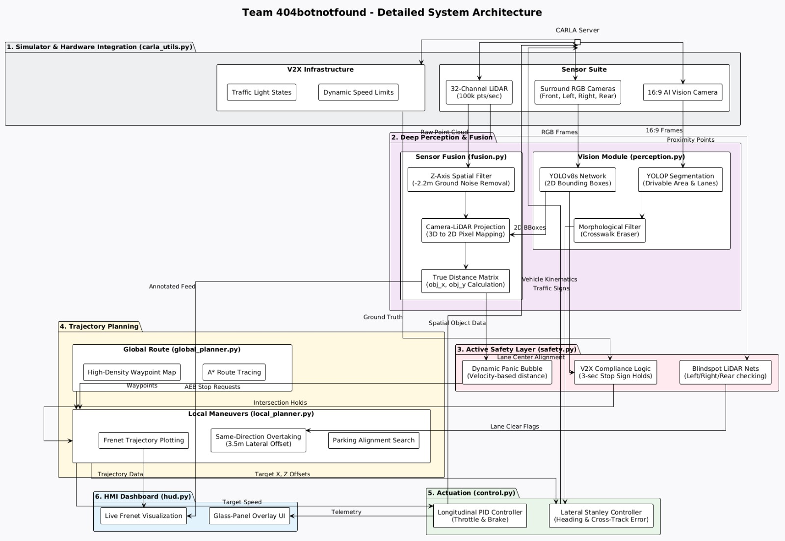

# 🚗 Virtual Vahana: Advanced ADAS & Semi-Autonomous Driving Stack

<p align="center">
  <b>Team:</b> 404botnotfound &nbsp;|&nbsp; <b>Competition:</b> Student ADAS & Semi-Autonomous Driving Challenge — Round 2
</p>

<p align="center">
  
  
  
  
  
  
</p>

<p align="center">
  <a href="https://youtu.be/7FWkwuvbBSk?si=pYO2d8YBfAZOUbP-">
    
  </a>
  <a href="./Virtual_vahana_round2_techinalReport.pdf">
    
  </a>
  <a href="https://youtu.be/kqOzSTb72sk">
    
  </a>
</p>

## Overview

**Virtual Vahana** is a modular, high-performance **ADAS + Semi-Autonomous Driving system** built inside the **CARLA 0.9.16 Simulator**. The vehicle drives entirely on its own — no keyboard input, no gamepad — making every decision from lane following to emergency braking using live sensor data processed through a clean, professional pipeline.

The system implements a strict, unidirectional:

> **Perception → Fusion → Safety → Planning → Control**

pipeline across **8 specialised modules**, with **Camera-LiDAR sensor fusion**, **physics-based risk prediction**, **V2X-assisted traffic compliance**, and **Frenet trajectory planning** — bridging the gap between traditional ADAS and full autonomy.

The car can:
- Follow lanes through curves and intersections
- Detect and stop for pedestrians — even partially occluded ones
- Obey traffic lights and stop signs
- Overtake stopped vehicles with blindspot checking
- Pull into a shoulder parking spot at the destination
- Recover from being stuck by reversing and retrying
- Display all decisions live on a custom glass-panel dashboard

Everything runs at a sustained **20 FPS** on a mid-range GPU.

---

## ✨ Key Features

### 👁️ Perception Stack
- **YOLOv8s** — Real-time object detection at 40%+ confidence across 10 classes: pedestrians, cars, trucks, buses, motorcycles, bicycles, traffic lights, stop signs, fire hydrants, and benches
- **YOLOP** — Panoptic driving perception: simultaneous drivable area segmentation (green overlay) + lane line detection (magenta overlay) from a single neural network pass
- **Crosswalk Eraser** — Custom morphological filter (vertical 9×2 kernel) that mathematically destroys horizontal crosswalk stripes from the lane mask while preserving vertical lane lines — eliminating intersection steering errors
- Dual-camera strategy: center camera for object detection, dedicated 16:9 AI Vision camera for lane segmentation (matching dashcam training geometry)

### 🔗 Sensor Fusion (Innovation Feature ✅)
- **32-channel LiDAR → Camera Projection** using the Pinhole Camera Model
- Focal length derived from FOV: `f = 800 / (2 × tan(45°)) = 400px`
- 3D point `(X, Y, Z)` projected to pixel `(u, v)`: `u = f·Y/X + cx`, `v = f·(−Z)/X + cy`
- **Z-axis Leg Filter**: keeps only points between −2.2m and +1.0m — discards ground plane (−2.4m) while capturing pedestrian feet (−1.8m to −2.0m) for detection even under torso occlusion
- After fusion, every detection carries exact **obj_x** (forward metres) and **obj_y** (lateral metres) — the ground truth used by every downstream module

### 🛑 Active Safety System
- **Dynamic Panic Bubble** — minimum safe distance scales quadratically with speed: `D = max(4.5, 4.5 + v×0.5 + v²/8)` — at 30 km/h this is 17.4m (~2.1 seconds), providing the 3–5 second risk prediction window required by the rubric
- **AEB Hold** — emergency stop held for 15 frames (~0.75s) after pedestrian detection, handling neural network flicker between frames
- **Lateral Constraint** — AEB only triggers for pedestrians within ±1.5m laterally, preventing phantom braking for people safely on the pavement
- **Vision-Only Fallback** — if LiDAR misses an occluded pedestrian, AEB triggers on bounding box size (>100px height) + centre-column position alone
- **LiDAR Safety Net** — independent raw point cloud scan of the forward corridor, AEB triggers on >15 points regardless of object detection output
- **Parking Mode** — tightens safety corridor to chassis width (±0.85m) and raises Z-floor to −1.5m when pulling over, preventing false triggers from kerbs and street furniture

### 🌐 V2X Traffic Compliance
- **Traffic Lights** — queries CARLA's infrastructure API directly (`is_at_traffic_light()` + `get_traffic_light_state()`), simulating IEEE 802.11p V2I wireless protocols — eliminates all pixel-level ambiguity of rendering compressed signals at 40+ metres
- **Stop Signs** — vision detects the sign; bounding box area >3500px² confirms proximity (8–12m); mandatory **60-frame (3-second) complete halt** enforced; 100-frame ignore window prevents re-trigger as vehicle clears the intersection
- **Speed Limits** — cruise speed enforced from CARLA map data, updated dynamically per road segment

### 🗺️ Planning & Control

#### Global Planning
- **A* pathfinding** on CARLA's road topology via `GlobalRoutePlanner`
- **2-metre waypoint resolution** — smooth curvature handling through every bend
- **Interactive minimap** — click anywhere to set or change destination mid-drive; route recalculates instantly

#### Local Planning
- **Frenet Trajectory Generation** — converts global route into per-frame vehicle-frame target coordinates `(forward_dist, lateral_dist)`
- **10-point spline** projected forward each frame using quadratic lateral interpolation for smooth, human-like arc entry
- **Safe Same-Direction Overtaking** — checks: (1) adjacent lane is a Driving lane, (2) lane ID signs confirm same traffic direction, (3) LiDAR blindspot sweep clear — only then initiates a smooth 4.5-second exponential lateral shift of ±3.5m
- **Stuck Recovery** — if AEB holds and speed is near-zero for >20 frames, reverses at 5 km/h until a 15m forward gap is created
- **Automatic Parking** — on route completion, traverses rightward through lane types until a Shoulder/Parking lane is found, builds a short parking route, and pulls in at 5–10 km/h

#### Control System
- **Stanley Kinematic Controller** (lateral) — corrects both heading error `ψe = atan2(x_target, z_target)` and cross-track error simultaneously: `δ = ψe + atan(k·ecte / (v + ksoft))` with `k=0.55`, `ksoft=1.0`
- **PID Controller** (longitudinal) — `Kp=1.0, Ki=0.1, Kd=0.05` at 20Hz; PID is hard-reset on AEB to prevent integral windup causing throttle surge on release
- Positive output → throttle, negative → brake, split cleanly at zero with no deadband

---

## System Architecture

<p align="center">
  
</p>

---

## 📂 Project Structure

```text
Virtual_Vahana/
├── main.py                  # Runtime loop, state machine, HMI composition
├── core/
│   ├── perception.py        # YOLOv8 + YOLOP + crosswalk eraser
│   ├── fusion.py            # LiDAR-camera projection + lane overlay
│   ├── safety.py            # AEB, panic bubble, V2X, stop sign logic
│   ├── global_planner.py    # A* routing + minimap renderer
│   ├── local_planner.py     # Frenet spline + overtake + parking
│   ├── control.py           # Stanley + PID controllers
│   └── hud.py               # Glass-panel dashboard compositor
├── utils/
│   └── carla_utils.py       # CARLA connection, sensor spawning, callbacks
├── models/
│   └── yolov8s.pt           # YOLOv8 small pretrained weights
└── requirements.txt
```

---

## 🛠️ Installation & Setup

### Prerequisites
- OS: Windows 10/11 or Ubuntu 20.04+
- GPU: NVIDIA with CUDA support (recommended: RTX 2060 or better)
- Python 3.12
- CARLA 0.9.16

### 1️⃣ Download CARLA 0.9.16

```bash
# Download from the official releases page:
# https://github.com/carla-simulator/carla/releases/tag/0.9.16
./CarlaUE4.sh -quality-level=Epic        # Linux
# CarlaUE4.exe -quality-level=Epic      # Windows
```

### 2️⃣ Clone Repository

```bash
git clone https://github.com/sailesh2408/Virtual_Vahana_Round-2_404botnotfound.git
cd Virtual_Vahana_Round-2_404botnotfound
```

### 3️⃣ Create Virtual Environment

```bash
python -m venv venv
source venv/bin/activate        # Linux/Mac
# venv\Scripts\activate         # Windows
```

### 4️⃣ Install Dependencies

```bash
pip install -r requirements.txt
```

### 5️⃣ Add YOLOP (PyTorch Hub — automatic on first run)
YOLOP is loaded automatically via `torch.hub.load('hustvl/yolop', 'yolop', pretrained=True)` on the first run. Ensure you have an internet connection for the initial download.

---

## 🚀 Running the Project

### Step 1: Launch CARLA Server

```bash
# Linux
./CarlaUE4.sh

# Windows
CarlaUE4.exe
```

### Step 2: Run the Autonomous Stack

```bash
python main.py
```

The system will spawn the vehicle, attach all sensors, load both AI models, pre-cache the map topology, and wait for you to click a destination on the minimap.

---

## 🎮 Controls

| Input | Action |
|-------|--------|
| 🖱️ Left Click on Minimap | Set new destination — route recalculates instantly |
| `R` | Reset: respawn vehicle, re-attach sensors, clear route |
| `Q` | Quit simulation and clean up all actors |

> Once a destination is clicked, the vehicle drives entirely autonomously. No further input is needed.

---

## 📊 Dashboard / HMI

The live display is a **1600×600 glass-panel dashboard** composited in real time:

| Region | Content |
|--------|---------|
| Left (800×600) | Center camera feed with YOLOv8 bounding boxes + fused distance annotations |
| Centre-top (400×400) | Frenet trajectory plot — bird's-eye view of planned spline + obstacle positions |
| Centre-bottom | Status text, current speed / target speed, steering angle |
| Right-top (400×400) | Interactive minimap — A* route (green) + ego position (yellow dot) |
| Right-bottom | AI Vision feed (YOLOP overlays) — switches to Rear Camera during reversing |

**Status messages include:** `AUTONOMOUS DRIVING` · `AEB ACTIVE - STOPPING` · `EXECUTING OVERTAKE` · `BUILDING OVERTAKE GAP` · `PULLING OVER` · `SPOT BLOCKED - WAITING` · `STOP SIGN: MANDATORY HALT` · `RED LIGHT: STOPPING` · `PARKED SUCCESSFULLY!`

The status panel turns **red** when AEB is active for immediate visual salience.

---

## 🔬 Technical Deep-Dives

### Camera-LiDAR Fusion
The Pinhole Camera Model maps every 3D LiDAR point `(X, Y, Z)` to image pixel `(u, v)`:

```
focal_length = image_width / (2 × tan(FOV/2)) = 400px

u = (focal × Y / X) + cx
v = (focal × −Z / X) + cy
```

Points projecting inside a YOLOv8 bounding box, and passing the Z-axis height filter (`−2.2m < Z < 1.0m`), are candidates for depth extraction. The closest candidate gives the true object distance. The `−2.2m` floor specifically retains pedestrian feet while discarding asphalt ground returns at `−2.4m`.

### Dynamic Panic Bubble
```
v_ms = speed_kmh / 3.6
D_panic = max(4.5,  4.5 + (v_ms × 0.5) + (v_ms² / 8.0))
```
At 30 km/h → **17.4m** (~2.1s warning). Capped at 20m. Overtake flagged at 20m → ~5s advance warning. Derived from real kinematic stopping distance, not an arbitrary threshold.

### Crosswalk Eraser
```python
kernel = cv2.getStructuringElement(cv2.MORPH_RECT, (2, 9))  # tall, thin
ll_mask = cv2.morphologyEx(ll_mask, cv2.MORPH_OPEN, kernel)
```
Morphological opening with a vertical kernel destroys horizontal features (crosswalk stripes) while preserving vertical ones (lane lines). Solved intersection steering without any retraining.

### Stanley Lateral Controller
```
heading_error  = atan2(x_target, z_target)
crosstrack_err = x_target
steering       = heading_error + atan(k × crosstrack_err / (v + k_soft))
               where k=0.55, k_soft=1.0
```

### Safe Overtaking Logic
```python
# Adjacent lane must be:
# 1. A driving lane (not shoulder/footpath)
# 2. Same traffic direction (lane_id signs match — prevents oncoming traffic collision)
# 3. Blindspot clear (LiDAR sweep: x ∈ [−8, 2], y ∈ [±1.5, ±4.0])
if curr_wp.lane_id * adj_wp.lane_id > 0:  # same sign = same direction
    # Smooth exponential lateral shift: δ += 0.05 × (target − δ) per frame
    # Full 3.5m shift takes ~4.5 seconds at 20 FPS
```

---

## 📦 Requirements

```txt
ultralytics        # YOLOv8
torch              # PyTorch (CUDA recommended)
torchvision        # YOLOP transforms
numpy              # Point cloud processing
opencv-python      # Image processing + HMI
pillow             # Anti-aliased text rendering (SF Pro font)
simple-pid         # PID longitudinal controller
```

---

## 🎥 Project Deliverables

### 📹 Demo Video
A complete demonstration of the Virtual Vahana ADAS stack in CARLA, showcasing:
- Autonomous lane following
- Pedestrian detection and emergency braking
- Traffic light and stop sign compliance
- Safe overtaking
- Automatic parking
- HMI visualisation

> 🔗 **Demo Video Link:** [Watch here](https://youtu.be/7FWkwuvbBSk?si=Ew0DsobEqoeNQvz_)

---

### 📄 Technical Report
A detailed technical report covering:
- System architecture
- Module-wise design
- Perception and sensor fusion pipeline
- Safety logic and risk prediction
- Planning and control algorithms
- Experimental observations
- Competition rubric mapping

> 📥 **[Download Technical Report (PDF)](Virtual_vahana_round2_techinalReport.pdf)**
---

### 🎙️ Explanation Video
A technical walkthrough explaining:
- Overall system pipeline
- Key innovations (LiDAR-camera fusion, panic bubble, V2X)
- Algorithm choices (YOLOv8, YOLOP, Stanley, PID, Frenet)
- Safety and robustness mechanisms
- Team contributions and implementation strategy

> 🔗 **Explanation Video Link:** [Watch me ](https://youtu.be/kqOzSTb72sk)

## 📊 Competition Rubric Coverage

| Rubric Category | Implementation |
|----------------|----------------|
| Autonomous Lane Following | YOLOP + crosswalk eraser + Stanley controller + Frenet spline |
| Dynamic Obstacle Handling | Panic bubble + LiDAR fusion + overtake + reversing recovery |
| Pedestrian Safety | Fused AEB + lateral constraint + hold frames + vision fallback |
| Traffic Sign Compliance| V2X traffic lights + stop sign hold + speed limit enforcement |
| System Stability & Safety | 20 FPS + modular pipeline + raw LiDAR safety net |
| Architecture Clarity | 5-layer pipeline, 8 single-responsibility modules |
| Algorithm Design | Pinhole fusion, Frenet planning, Stanley + PID control |
| Innovation | Sensor Fusion + Risk Prediction (both criteria met) |
| Dashboard / HMI | 6-widget glass-panel dashboard with real-time decision display |

---

## 📚 References

1. **CARLA Simulator** — Dosovitskiy et al., CoRL 2017 — https://carla.org/
2. **YOLOv8** — Ultralytics, 2023 — https://github.com/ultralytics/ultralytics
3. **YOLOP** — Wu et al., Machine Intelligence Research, 2022 — https://github.com/hustvl/YOLOP
4. **Stanley Controller** — Hoffmann et al., American Control Conference, 2007
5. **Frenet Frame Trajectories** — Werling et al., IEEE ICRA, 2010
6. **Simple PID** — https://github.com/m-lundberg/simple-pid

---

## 🏁 Future Improvements

- **Multi-agent prediction** using Graph Neural Networks for long-horizon traffic intent modelling
- **End-to-end imitation learning** integration alongside the modular stack
- **Real-world dataset adaptation** for KITTI / nuScenes / Waymo transfer
- **TensorRT inference optimisation** for embedded deployment
- **HD Map integration** for lane-level localisation
- **True DSRC/C-V2X simulation** with latency and packet loss modelling

---

## 👨‍💻 Meet the Team

**Team 404botnotfound**  
**Amrita Vishwa Vidyapeetham, Kollam, Kerala**

### Members
- **Bhavana PH**
- **Y Sai Sailesh Reddy**
- **Sidharth R Krishna**

> *Built with precision, performance, and a bit of madness 🚀*
---

## ⭐ Final Note

Virtual Vahana is not a patched-together demo. Every design decision — from the `−2.2m` Z-floor to the `0.05` exponential gain on lane changes — is traceable to a specific failure mode encountered during development and a principled engineering fix. The result is a system that is both **competition-ready** and architecturally **scalable to real-world deployment**.
